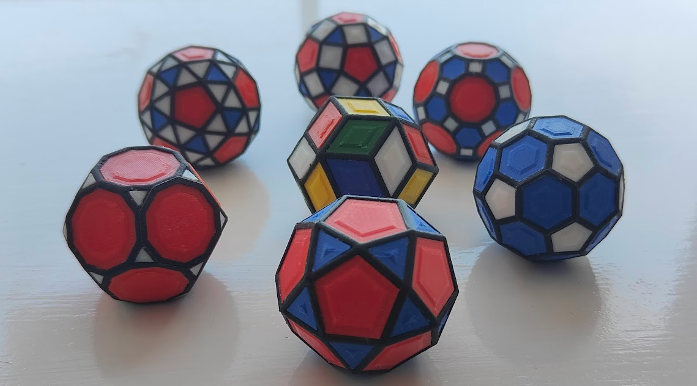

[](https://github.com/susanw1/PolySymmetrica/actions/workflows/run_tests.yml)
[](https://opensource.org/licenses/MIT)

# PolySymmetrica

PolySymmetrica is a polyhedral modelling library for OpenSCAD, aimed at making
beautiful 3d printed models.

It gives you named solids, geometric transforms, placement tools, and topology
helpers for building structured polyhedral models without hand-writing the
rotations and coordinate frames yourself.

Use it to make:

- decorated Platonic, Archimedean, Catalan, Johnson, prism, and antiprism forms;
- custom geometry attached cleanly to every face, edge, or vertex of a solid;
- transformed solids using duals, truncation, rectification, chamfering,
  cantellation, cantitruncation, snubs, and construction helpers;
- exploratory or printable polyhedral frame and face assemblies.

PolySymmetrica is still OpenSCAD: the output is ordinary OpenSCAD geometry, and
your child modules can be regular OpenSCAD modules. The library supplies the
polyhedral structure, local frames, and metadata.

## OpenSCAD Version

PolySymmetrica targets the current OpenSCAD development snapshots, not the 2021
release. Install a snapshot build from the
[OpenSCAD downloads page](https://openscad.org/downloads.html#snapshots).

[Note that this is commonly recommended anyway as the 2026 OpenSCAD releases are wildly 
faster than the 2021 stable release, and when it is released, we'll change these instructions.]

The examples below assume the `polysymmetrica/` library path is configured and
can be rendered with `openscad-nightly`.

## The Core Idea

OpenSCAD is good at describing a piece of geometry. It is less pleasant when
you need to repeat that geometry across every symmetry site of a polyhedron.

PolySymmetrica turns a polyhedron into a reusable placement surface:

- `place_on_faces(...)` runs child geometry once per face;
- `place_on_edges(...)` runs child geometry once per edge;
- `place_on_vertices(...)` runs child geometry once per vertex.

Inside those child modules, `$ps_*` values describe the current site: local
axes, lengths, radii, source indices, family ids, neighbouring faces, and other
context. That lets a child module size and orient itself from the polyhedron
instead of from hand-coded rotations.

## First Taste

With `polysymmetrica/` available on OpenSCAD's library path, try:

```scad
use <polysymmetrica/core/placement.scad>
use <polysymmetrica/core/truncation.scad>
use <polysymmetrica/models/platonics_all.scad>

p = poly_truncate(dodecahedron());

color("plum")
    place_on_faces(p, inter_radius = 35)
        linear_extrude(1) polygon($ps_face_pts2d);

color("gold")
    place_on_vertices(p, inter_radius = 35)
        sphere(r = 1.6, $fn = 16);

color("silver")
    place_on_edges(p, inter_radius = 35)
        cube([$ps_edge_len, 1.5, 1], center = true);
```

This builds a truncated dodecahedron: it renders a polygon on each face, places a small
sphere on every vertex using the vertex-local placement context, and puts a silver bar on
each edge. See [Getting started](docs/getting_started.md) for checkout and project setup.


Source: [`docs/examples/first_taste.scad`](docs/examples/first_taste.scad)

## What You Can Build With

**Named models**

Platonic solids, Archimedean and Catalan families, selected Johnson solids,
prisms, antiprisms, and polygram variants.

**Transforms**

Duals, truncation, rectification, chamfering, cantellation, cantitruncation,
snub construction, and construction operations such as delete/cap/slice/attach.

**Placement**

Face, edge, and vertex placement with stable local frames and site metadata.
This is the main route for decorative surfaces, frames, labels, sockets, and
custom repeated geometry.

**Classification and profiles**

Faces, edges, and vertices can be grouped into families. Those families can
drive placement, structured parameter profiles, and transform behavior.

**Advanced face analysis**

Self-crossing and non-convex faces can be split, inspected, and used in more
specialized face-region and proxy-interaction workflows.

## Examples To Open

Start here:

- `src/examples/basics/main_basics.scad`
- `src/examples/basics/main_prisms.scad`
- `src/examples/basics/main_attach.scad`
- `src/examples/truncation/main_transforms_all.scad`
- `src/examples/classify/main_classify.scad`

More advanced demos live under:

- `src/examples/segments/`
- `src/examples/printing/`
- `src/examples/poly-frame/`

## Documentation

Current guides and notes:

- [Getting started](docs/getting_started.md)
- [Tutorials](docs/tutorials/index.md)
- [Documentation images](docs/images.md)
- [API reference](docs/api/index.md)
- [Developer guide](docs/developer_guide.md)
- [Construction helpers](docs/guides/construction.md)
- [Face attachment](docs/guides/attach.md)
- [Prisms and antiprisms](docs/guides/prisms.md)
- [Profile rows](docs/guides/profile.md)
- [Cantellation](docs/guides/cantellation.md)
- [Cantitruncation](docs/guides/cantitruncation.md)
- [Snubs](docs/guides/snubs.md)

Reference and design notes:

- [Placement data model](docs/reference/placement_data_model.md)
- [Face segments](docs/design/segments.md)
- [Face regions](docs/design/face_regions.md)
- [Face arrangement](docs/design/face_arrangement.md)
- [Proxy interaction](docs/design/proxy_interaction.md)

## License

PolySymmetrica is released under the MIT license.

Follow project updates on Bluesky:
[`@polysymmetrica.bsky.social`](https://bsky.app/profile/polysymmetrica.bsky.social).
