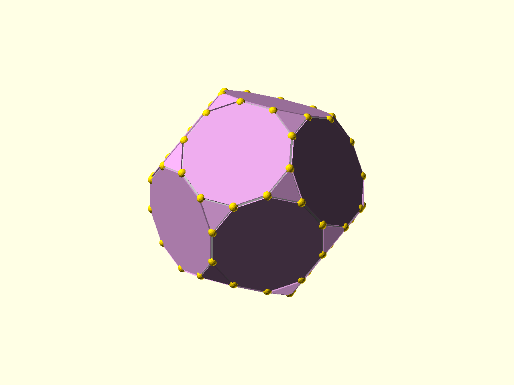

# Documentation Images

Documentation images should be useful, reproducible, and traceable back to the
source that produced them.

## Generated Renders

Generated OpenSCAD renders live under:

```text
docs/images/generated/
```

Each generated image should have a source `.scad` file under `docs/examples/`
or another documented source path. Prefer `docs/examples/` for tutorial and
README scenes because those files are short, public-facing, and runnable on
their own.

Render all generated documentation images from the repository root with:

```bash
scripts/render_docs_images.sh
```

Render one target with:

```bash
scripts/render_docs_images.sh first_taste
```

Available targets are listed by `scripts/render_docs_images.sh --help`.

On a headless machine, wrap the command with `xvfb-run`:

```bash
xvfb-run -a scripts/render_docs_images.sh first_taste
```

The script sets `OPENSCADPATH` to this checkout's `src/` directory, so example
files can use the stable public import form:

```scad
use <polysymmetrica/core/placement.scad>
use <polysymmetrica/models/platonics_all.scad>
```

Do not write `src/` into documentation example imports. `src/` is a repository
layout detail, not part of the public library path.

## Markdown Pattern

When a page uses a generated image, link back to the source file:

```md


Source: [`docs/examples/first_taste.scad`](examples/first_taste.scad)
```

Short Markdown excerpts may duplicate the source by hand, but the full runnable
source should stay in the linked `.scad` file. If hand-maintained snippets start
to drift, add snippet markers to the `.scad` files and generate excerpts later.

## Naming

Use lower snake case for generated image and source names:

```text
docs/examples/first_taste.scad
docs/images/generated/first_taste.png
```

Keep names stable once linked from README or tutorials.

## Photos And Gallery Images

Use repository images for learning material and the public landing page. Larger
print galleries, work-in-progress photos, and less reproducible showcase images
should live in the GitHub Wiki, releases, or another gallery space rather than
bloating the core repository.

If a small curated photo is useful in the versioned docs, place it under:

```text
docs/images/photos/
```

and add a short provenance note near the image or in the page that uses it.
