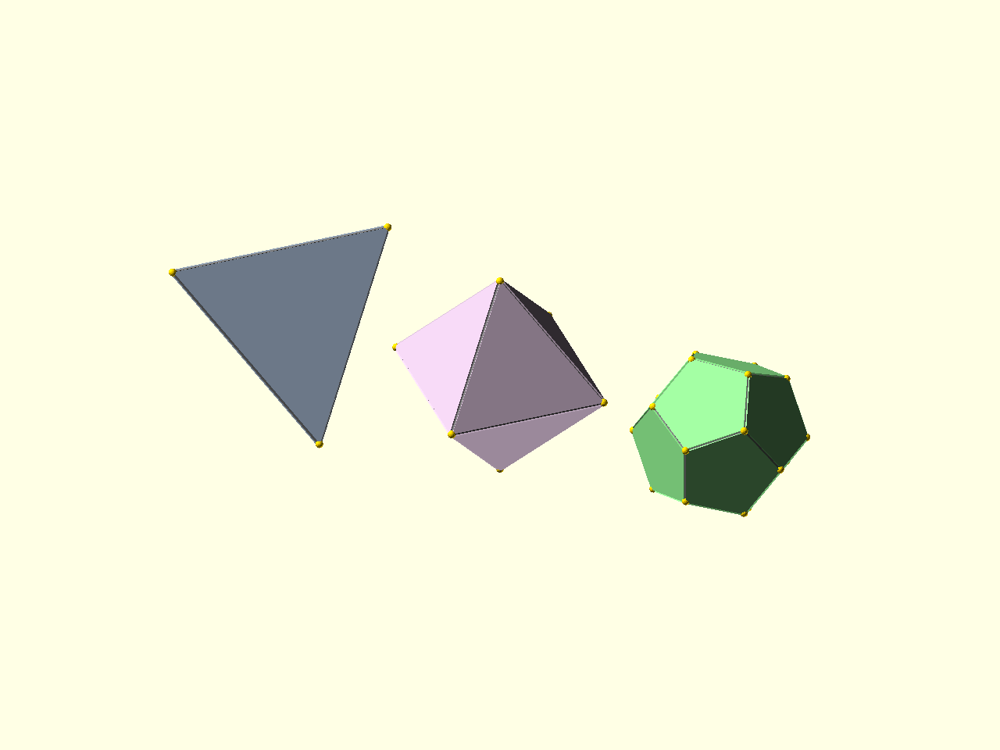

# Models

PolySymmetrica starts with a polyhedron descriptor. Most examples get one from a
model constructor such as `tetrahedron()`, `octahedron()`, or `dodecahedron()`.



Source: [`docs/examples/tutorial_01_models.scad`](../examples/tutorial_01_models.scad)

The example creates three descriptors and passes each one to the same preview
module:

```scad
translate([-72, 0, 0])
    preview_poly(tetrahedron(), 24, "lightsteelblue");

preview_poly(octahedron(), 24, "thistle");

translate([72, 0, 0])
    preview_poly(dodecahedron(), 24, "palegreen");
```

The preview module uses placement rather than hard-coded rotations. It fills
each face, draws each edge, and marks each vertex from the same descriptor.

The important habit is to keep the descriptor separate from the geometry you
place on it. Once the descriptor changes, the same child modules can be replayed
on a different solid.

Next: [Placement](02_placement.md).
