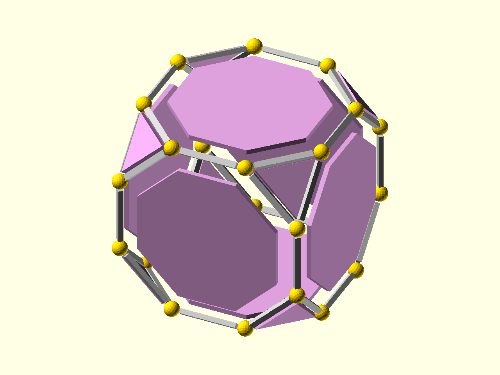

# Placement

[Prev: Models](01_models.md) | [Index](index.md) | [Next: Basic printing](03_basic_printing.md)

Placement modules replay child geometry at every face, edge, or vertex of a
polyhedron. Inside the child module, `$ps_*` values describe the current site.



Source: [`docs/examples/tutorial_02_placement.scad`](../examples/tutorial_02_placement.scad)

The example starts with a transformed model:

```scad
p = poly_truncate(hexahedron());
ir = 32;
```

Then each placement module supplies the local frame and metadata needed by its
child:

```scad
place_on_faces(p, inter_radius = ir)
    inset_face_panel();

place_on_edges(p, inter_radius = ir)
    edge_bar();

place_on_vertices(p, inter_radius = ir)
    vertex_marker();
```

The face child uses `$ps_face_pts2d`, which is the current face in face-local 2D
coordinates:

```scad
module inset_face_panel() {
    color("plum")
        linear_extrude(height = 1.2)
            polygon(points = $ps_face_pts2d * 0.75);
}
```
Normally, the list of points in `$ps_face_pts2d` would exactly fit the face location, but multiplying it by 0.75 shrinks it,
as shown.

The edge child uses `$ps_edge_len` so every bar fits its current edge:

```scad
module edge_bar() {
    color("silver")
        cube([$ps_edge_len * 0.76, 1.5, 1.2], center = true);
}
```

That is the central PolySymmetrica workflow: choose a descriptor, then write
small local child modules that respond to the current placement context.

[Prev: Models](01_models.md) | [Index](index.md) | [Next: Basic printing](03_basic_printing.md)
