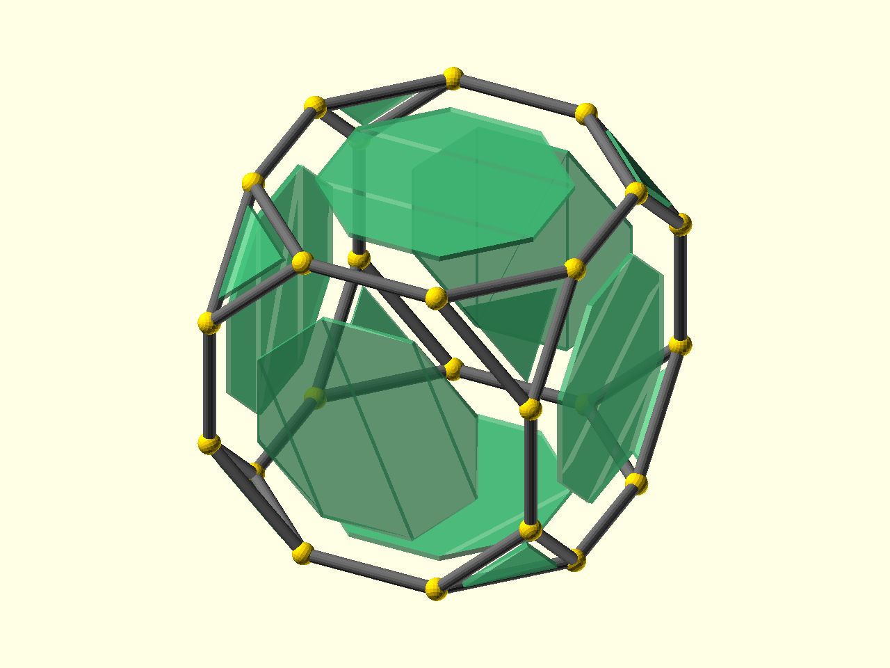

# Basic Printing

[Prev: Placement](02_placement.md) | [Index](index.md) | [Next: Placement metadata](04_placement_metadata.md)

Placement is enough to make useful first prints. This tutorial keeps to two
support-light patterns: an edge-only frame and a face-only shell.



Source: [`docs/examples/tutorial_03_basic_printing.scad`](../examples/tutorial_03_basic_printing.scad)

The example uses a cuboctahedron, which gives both square and triangular faces
while keeping the geometry easy to inspect.

```scad
p = cuboctahedron();
ir = 20;
```

## Edge Frame

The frame version uses only `place_on_edges(...)`. Each child module receives an
edge-local frame where X runs along the current edge, so `$ps_edge_len` gives the
right strut length:

```scad
module frame_strut() {
    color("dimgray")
        hull() {
            translate([-$ps_edge_len / 2, 0, 0])
                sphere(d = strut_d, $fn = 16);
            translate([$ps_edge_len / 2, 0, 0])
                sphere(d = strut_d, $fn = 16);
        }
}

translate([-model_gap / 2, 0, model_lift])
    place_on_edges(p, inter_radius = ir)
        frame_strut();
```

That pattern is the simplest printable polyhedron: a connected edge graph with
thickened struts. The Z translation puts the rounded lower struts on the build
plate for this orientation.

## Face Shell

The face version uses only `place_on_faces(...)`. A face-local polygon at `z=0`
lies on the original face plane. Extruding inward turns each placed polygon into
part of a connected shell:

```scad
module inward_face_plate() {
    color(face_colors[$ps_face_idx % len(face_colors)])
        translate([0, 0, -wall_thk])
            linear_extrude(height = wall_thk)
                polygon(points = $ps_face_pts2d);
}

translate([model_gap / 2, 0, model_lift])
    place_on_faces(p, inter_radius = ir)
        inward_face_plate();
```

The outer face remains at the original polyhedron surface, and the wall
thickness grows toward the interior. For the cuboctahedron, this gives a
straightforward face-only shell with both square and triangular panels.

## Vertex Placement

Blanket vertex decoration is often a poor first printing pattern. A sphere or
boss on every vertex can lift the model off the bed or create unsupported
underside geometry.

Use `place_on_vertices(...)` later when the vertex operation is selective or
subtractive: for example, adding feet only to build-plate vertices, drilling
registration holes, or trimming corners from an already printable solid.

Sockets, clearances, separate print-bed layout, and tolerance tuning build on
these same placement patterns and are covered in later printing material.

[Prev: Placement](02_placement.md) | [Index](index.md) | [Next: Placement metadata](04_placement_metadata.md)
