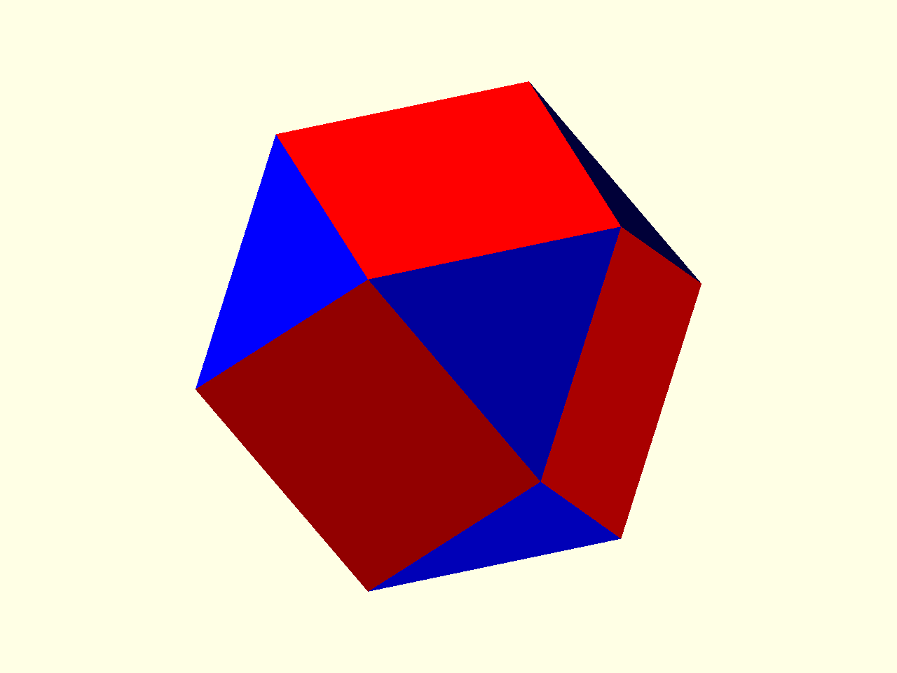

# Classification

Classification groups faces, edges, and vertices into matching families. A
simple first use is choosing which faces receive which placed geometry.



Source: [`docs/examples/tutorial_04_classification.scad`](../examples/tutorial_04_classification.scad)

The example starts with a cuboctahedron and computes a classification record:

```scad
p = cuboctahedron();
cls = poly_classify(p);
```

For this model, the useful face groups are the square faces and triangular
faces. The helper below returns the face indices whose family has the requested
number of sides:

```scad
square_faces = ps_classify_face_idxs_by_n(cls, 4);
triangle_faces = ps_classify_face_idxs_by_n(cls, 3);
```

Those index lists can be passed straight into `place_on_faces(...)`:

```scad
place_on_faces(p, inter_radius = ir, classify = cls, indices = square_faces)
    face_plate("red");

place_on_faces(p, inter_radius = ir, classify = cls, indices = triangle_faces)
    face_plate("blue");
```

The child module is the same inward face plate from the printing tutorial:

```scad
module face_plate(col) {
    color(col)
        translate([0, 0, -wall_thk])
            linear_extrude(height = wall_thk)
                polygon(points = $ps_face_pts2d);
}
```

This is the basic classification workflow: compute `cls` once, ask it for the
element groups you care about, then reuse the result in placement.
