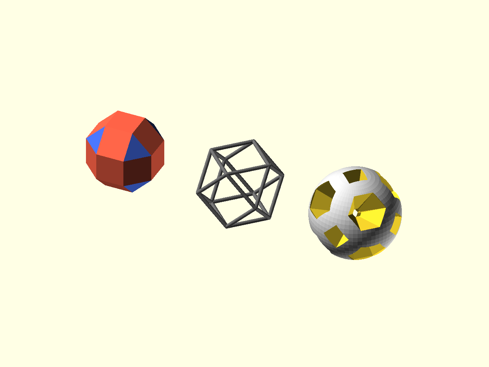

# Placement Metadata

Placement modules do more than move child geometry into position. While a child
module is running, `$ps_*` variables describe the current face, edge, or vertex.
Those values let one small module adapt itself to each placement site.



Source: [`docs/examples/tutorial_04_placement_metadata.scad`](../examples/tutorial_04_placement_metadata.scad)

## Face Shape

`$ps_face_pts2d` is the current face polygon in face-local 2D coordinates. A
basic face plate can use it directly:

```scad
linear_extrude(height = wall_thk)
    polygon(points = $ps_face_pts2d);
```

`$ps_vertex_count` is the number of vertices in the current face. This example
uses it to color triangular and square panels differently:

```scad
module face_count_shell() {
    col = ($ps_vertex_count == 3) ? "royalblue" : "tomato";

    color(col)
        translate([0, 0, -wall_thk])
            linear_extrude(height = wall_thk)
                polygon(points = $ps_face_pts2d);
}
```

## Edge Length

Inside `place_on_edges(...)`, `$ps_edge_len` is the current edge length in the
edge-local frame. A strut can fit every edge without hard-coded dimensions:

```scad
module fitted_edge_strut() {
    color("dimgray")
        hull() {
            translate([-$ps_edge_len / 2, 0, 0])
                sphere(d = 2.0, $fn = 16);
            translate([$ps_edge_len / 2, 0, 0])
                sphere(d = 2.0, $fn = 16);
        }
}
```

## Face-Local Center Direction

`$ps_poly_center_local` is the polyhedron center expressed in the current
face-local frame. It is useful when a cutter should travel from the face toward
the interior:

```scad
module face_cavity_cutter() {
    hull() {
        translate([0, 0, 5])
            linear_extrude(height = 8)
                polygon(points = $ps_face_pts2d * 0.78);
        translate($ps_poly_center_local)
            sphere(r = 0.8, $fn = 12);
    }
}
```

Placed into a `difference()`, that cutter makes face-shaped recesses in a
solid:

```scad
difference() {
    sphere(r = ir + 4, $fn = 64);
    place_on_faces(cavity_poly, inter_radius = ir)
        face_cavity_cutter();
}
```

The pattern is the same in each case: write a small local child module, then let
placement metadata supply the per-site values.

The full placement metadata reference lists the `$ps_*` variables available in
face, edge, vertex, seam, and proxy contexts:
[placement_data_model.md](../reference/placement_data_model.md).

Next: [Boolean print patterns](05_boolean_patterns.md).
