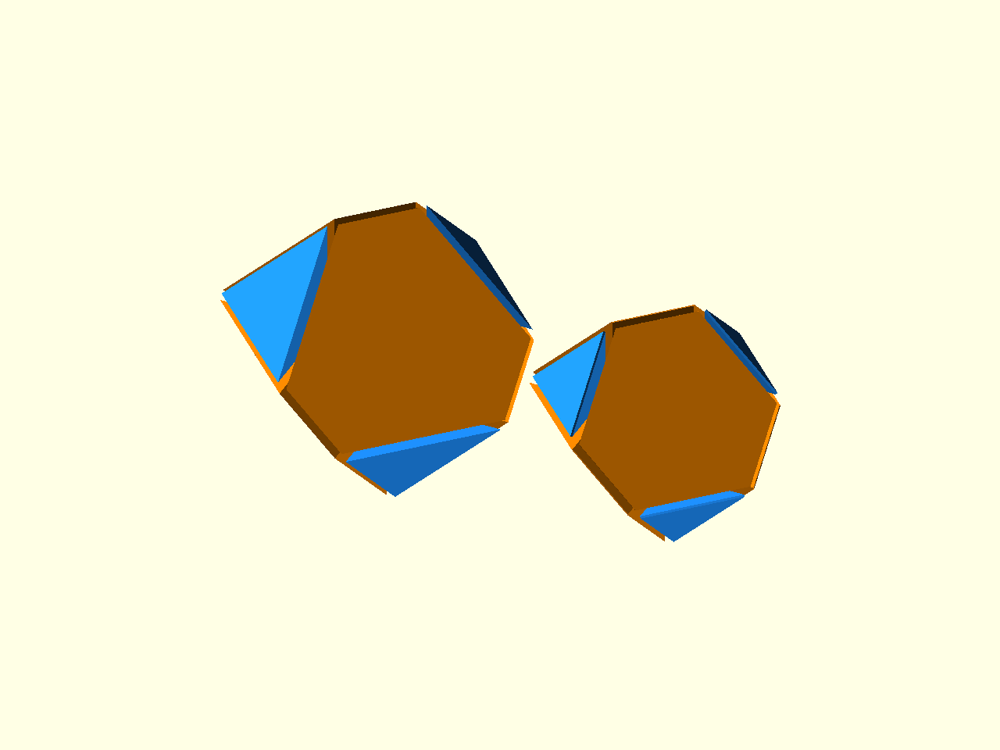

# Boolean Print Patterns

[Prev: Placement metadata](04_placement_metadata.md) | [Index](index.md) | [Next: Transforms](06_transforms.md)

Placement works naturally with OpenSCAD booleans. The child module can be a
solid part, a cutter, or a volume that clips another piece of geometry.


Source: [`docs/examples/tutorial_05_boolean_patterns.scad`](../examples/tutorial_05_boolean_patterns.scad)

## Face-Shaped Cutters

A placed face cutter can use `$ps_face_pts2d` for the mouth of the recess and
`$ps_poly_center_local` for its inward direction:

```scad
module face_cavity_cutter() {
    hull() {
        translate([0, 0, 5])
            linear_extrude(height = 8)
                polygon(points = $ps_face_pts2d * 0.78);
        translate($ps_poly_center_local)
            sphere(r = 0.8, $fn = 12);
    }
}
```

Use it inside `difference()` to subtract a family of aligned cavities:

```scad
difference() {
    sphere(r = ir + 4, $fn = 64);
    place_on_faces(cavity_poly, inter_radius = ir)
        face_cavity_cutter();
}
```

## Face-Region Volumes



Source: [`docs/examples/tutorial_05_face_region_volumes.scad`](../examples/tutorial_05_face_region_volumes.scad)

Face-local geometry can collide with neighbouring face space when it gets thick
or decorative. `ps_face_region_loop_volume(...)` builds the positive region
available to the current face. Used on its own, it shows the automatically
derived face-region shape:

```scad
module region_volume() {
    color(face_col())
        ps_face_region_loop_volume(z0, z1, boundary_inset = inset);
}
```

Intersecting with it clips an intentionally oversized face plate back to that
admissible volume:

```scad
module oversized_plate_clipped_to_region() {
    color(face_col())
        intersection() {
            ps_face_region_loop_volume(z0, z1, boundary_inset = inset);
            translate([0, 0, plate_z0])
                linear_extrude(height = plate_z1 - plate_z0)
                    polygon(points = $ps_face_pts2d * 1.22);
        }
}
```

This is the beginner version of anti-interference: use the generated volume as
a practical cutter that keeps each face's print geometry inside its own local
space. Later printing material covers the lower-level face-region model.

[Prev: Placement metadata](04_placement_metadata.md) | [Index](index.md) | [Next: Transforms](06_transforms.md)
