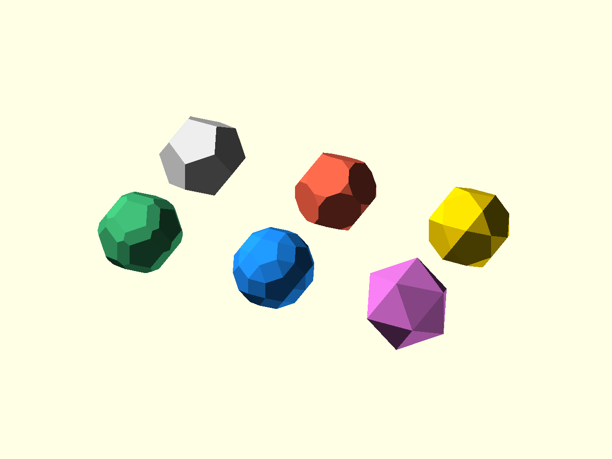

# Transforms

[Prev: Boolean print patterns](05_boolean_patterns.md) | [Index](index.md) | [Next: Prisms and antiprisms](07_prisms_antiprisms.md)

Transforms take an existing polyhedron descriptor and return a new descriptor.
The placement and printing modules from earlier chapters can then be reused on
the transformed result.



Source: [`docs/examples/tutorial_06_transforms.scad`](../examples/tutorial_06_transforms.scad)

The example starts with one base descriptor:

```scad
base = dodecahedron();
```

Each transform is a small, direct function call:

```scad
poly_truncate(base);
poly_rectify(base);
poly_chamfer(base);
poly_cantellate(base);
poly_dual(base);
```

The gallery renders those calls explicitly:

```scad
show_poly(base, -spacing, spacing / 2, "gainsboro");
show_poly(poly_truncate(base), 0, spacing / 2, "tomato");
show_poly(poly_rectify(base), spacing, spacing / 2, "gold");

show_poly(poly_chamfer(base), -spacing, -spacing / 2, "mediumseagreen");
show_poly(poly_cantellate(base), 0, -spacing / 2, "dodgerblue");
show_poly(poly_dual(base), spacing, -spacing / 2, "orchid");
```

The important habit is to keep transforms separate from placed geometry. Build
or transform the descriptor first, then pass the result into `place_on_faces`,
`place_on_edges`, `place_on_vertices`, or `poly_render`.

For star or otherwise self-crossing inputs, `poly_truncate(...)` and
`poly_rectify(...)` build vertex caps from the source vertex figure. Those caps
can legitimately be self-crossing faces. Use `poly_valid(p, "star_ok")` for
that class of output rather than convex/closed validation.

For vertices with valence greater than 3, raw same-fraction edge cuts can make
non-planar vertex caps when the incident edge lengths or directions vary.
`poly_truncate(...)` therefore uses `cap_mode="planar"` by default: it derives
the implicit cap plane from the requested edge-fraction cut, then intersects
that plane with the incident edges. Use `cap_mode="edge_fraction"` only when
you specifically want the raw legacy construction.

## API Catalogue

The deployed API docs are the catalogue view:

- [Models API](https://polysymmetrica.github.io/PolySymmetrica/dev/models/index.html)
- [Transform APIs](https://polysymmetrica.github.io/PolySymmetrica/dev/core/truncation.scad.html)
- [Dual APIs](https://polysymmetrica.github.io/PolySymmetrica/dev/core/duals.scad.html)

Transform defaults work well for regular examples. Later chapters show how
classification and profiles give finer control over mixed-family models.

[Prev: Boolean print patterns](05_boolean_patterns.md) | [Index](index.md) | [Next: Prisms and antiprisms](07_prisms_antiprisms.md)
