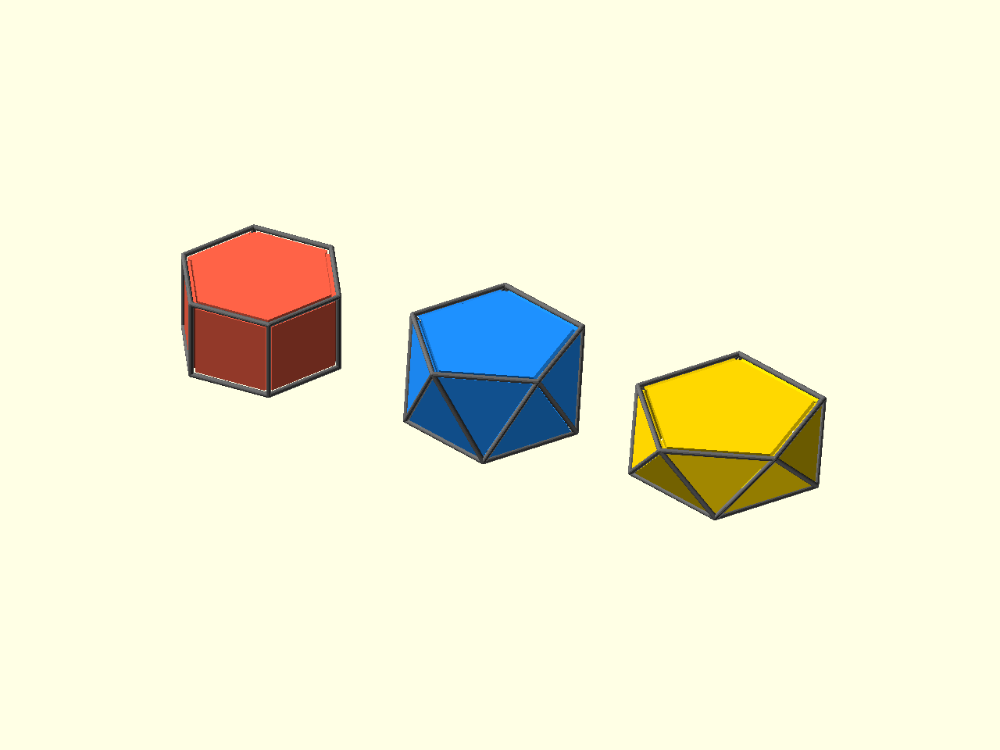

# Prisms And Antiprisms

[Prev: Transforms](06_transforms.md) | [Index](index.md) | [Next: Classification](08_classification.md)

Prisms and antiprisms are generated polyhedra, just like the named models from
the first tutorial. They are useful when the shape is better described by a
small parameter set than by a fixed name.



Source: [`docs/examples/tutorial_07_prisms_antiprisms.scad`](../examples/tutorial_07_prisms_antiprisms.scad)

The ordinary forms need only a side count:

```scad
prism = poly_prism(6);
antiprism = poly_antiprism(5);
```

`poly_prism(n)` builds two matching `n`-gonal caps joined by square side faces.
`poly_antiprism(n)` twists one cap and joins the caps with triangles.

The default antiprism height is solved from the requested edge length. You can
override it when you want a flatter or taller model:

```scad
low_antiprism = poly_antiprism(5, height = 0.55);
```

The returned value is the same poly descriptor used everywhere else, so the
placement patterns from earlier tutorials apply unchanged:

```scad
place_on_edges(prism, inter_radius = ir)
    frame_strut();

place_on_faces(antiprism, inter_radius = ir)
    face_plate();
```

`p` can describe star or retrograde cap steps, but those forms are easier to
discuss after the regular prism and antiprism workflow is familiar.

[Prev: Transforms](06_transforms.md) | [Index](index.md) | [Next: Classification](08_classification.md)
