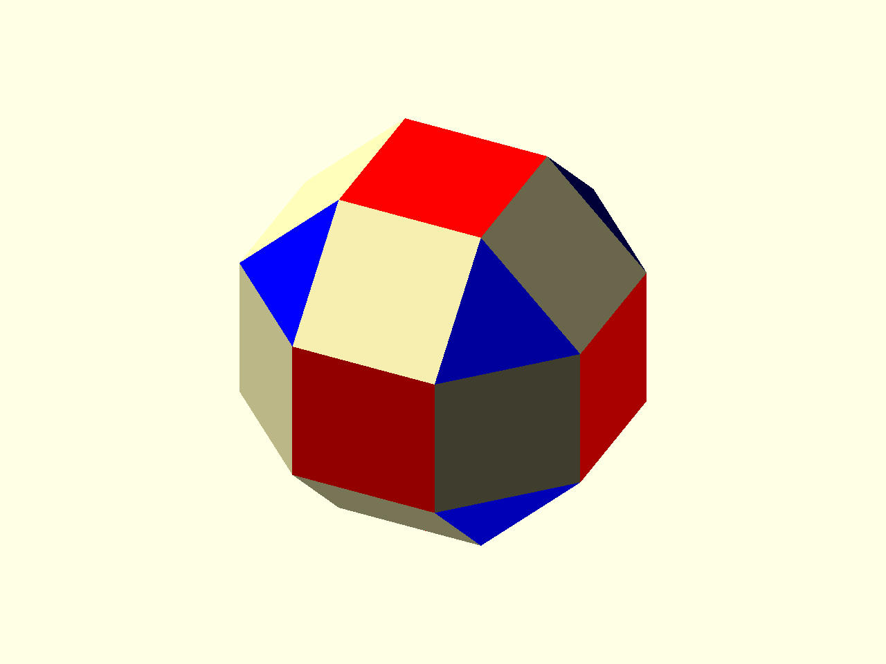

# Classification

Classification groups faces, edges, and vertices into matching families. A
simple first use is choosing which faces receive which placed geometry.



Source: [`docs/examples/tutorial_08_classification.scad`](../examples/tutorial_08_classification.scad)

The example starts with a rhombicuboctahedron and computes a classification
record:

```scad
p = rhombicuboctahedron();
cls = poly_classify(p);
```

Classification metadata is available inside placement when `classify = cls` is
passed to the placement module:

```scad
face_family_colors = ["red", "palegoldenrod", "blue"];

place_on_faces(p, inter_radius = ir, classify = cls) {
    col = face_family_colors[$ps_face_family_id];
    color(col)
        face_plate();
}
```

For this model, the first two face families are both square faces and the third
is the triangular face family. The two square families can therefore receive
different colors even though both have four sides.

The child module is the same inward face plate from the printing tutorial:

```scad
module face_plate() {
    translate([0, 0, -wall_thk])
        linear_extrude(height = wall_thk)
            polygon(points = $ps_face_pts2d);
}
```

This is the basic classification workflow: compute `cls` once, pass it into
placement, then use the resulting `$ps_*_family_id` metadata inside the child
geometry.

Next: [Tutorial index](index.md).
