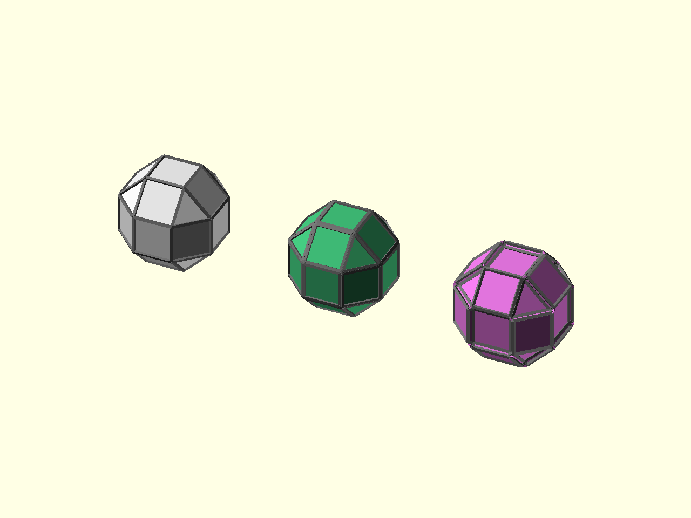

# Profiles

[Prev: Classification](08_classification.md) | [Index](index.md) | [Next: Construction helpers](10_construction.md)

Profiles are reusable parameter rows. They let you keep a transform call small
while still targeting all elements, a classified family, or explicit element
indices.



Source: [`docs/examples/tutorial_09_profiles.scad`](../examples/tutorial_09_profiles.scad)

A profile is just a list of rows. Each row names an element kind, a selector,
and one or more key/value pairs:

```scad
profile = [
    ["face", "all", ["df", 0.03]],
    ["face", "family", 1, ["df", 0.15]]
];
```

The selector can be:

- `"all"` for every element of that kind,
- `"family"` for a classification family,
- `"id"` for one index or a list of explicit indices.

Transform operators decide which keys they understand. `poly_cantellate(...)`
uses face rows with `df` or `c`, so the example applies a small offset to all
faces and a larger offset to one face family:

```scad
profiled = poly_cantellate(base, df = 0, profile = profile, cleanup = true);
```

Profiles are most useful after classification, because family selectors depend
on family IDs. Compute or inspect classification once when you need to know
which family number to target.

For performance-sensitive code, profiles can be compiled into dense lookup
arrays. That lower-level API is covered in the [profile guide](../guides/profile.md).

[Prev: Classification](08_classification.md) | [Index](index.md) | [Next: Construction helpers](10_construction.md)
