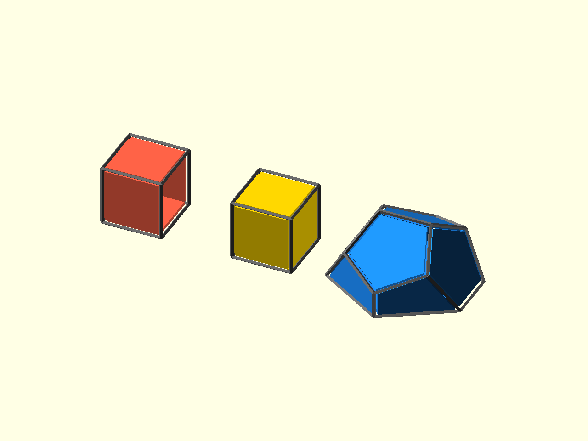
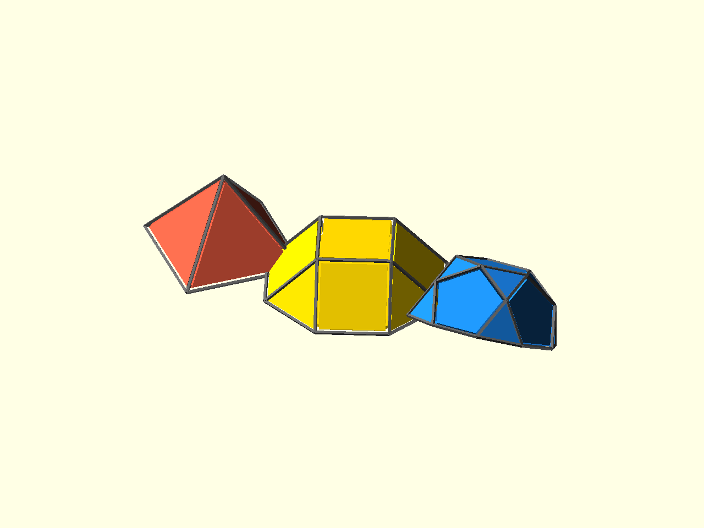

# Construction Helpers

[Prev: Profiles](09_profiles.md) | [Index](index.md) | [Next: Tutorial index](index.md)

Construction helpers make topology changes explicit. They are useful when a
model is easier to describe as a sequence of operations than as a named solid
or one transform.

## Open, Cap, Slice



Source: [`docs/examples/tutorial_10_construction_topology.scad`](../examples/tutorial_10_construction_topology.scad)

Deleting a face can leave an open boundary:

```scad
open_cube = poly_delete_faces(hexahedron(), 0, cap = false);
```

The same operation can cap the boundary immediately:

```scad
capped_cube = poly_delete_faces(hexahedron(), 0, cap = true);
```

`poly_slice(...)` clips a closed polyhedron by a plane and can cap the cut:

```scad
sliced_dodeca = poly_slice(
    dodecahedron(),
    [0, 0, 0],
    [0, 0, 1],
    keep = "above"
);
```

## Johnson-Style Constructors



Source: [`docs/examples/tutorial_10_construction_johnsons.scad`](../examples/tutorial_10_construction_johnsons.scad)

Some construction helpers directly build Johnson-style components:

```scad
j1 = poly_pyramid(4);
j4 = poly_cupola(4);
j6 = poly_rotunda();
```

Those are still ordinary poly descriptors. They can be rendered, placed on,
transformed, or used as inputs to later construction helpers.

The full construction notes cover attachment, elongation, gyroelongation, and
the assumptions behind these topology operations:
[construction.md](../guides/construction.md).

[Prev: Profiles](09_profiles.md) | [Index](index.md) | [Next: Tutorial index](index.md)
